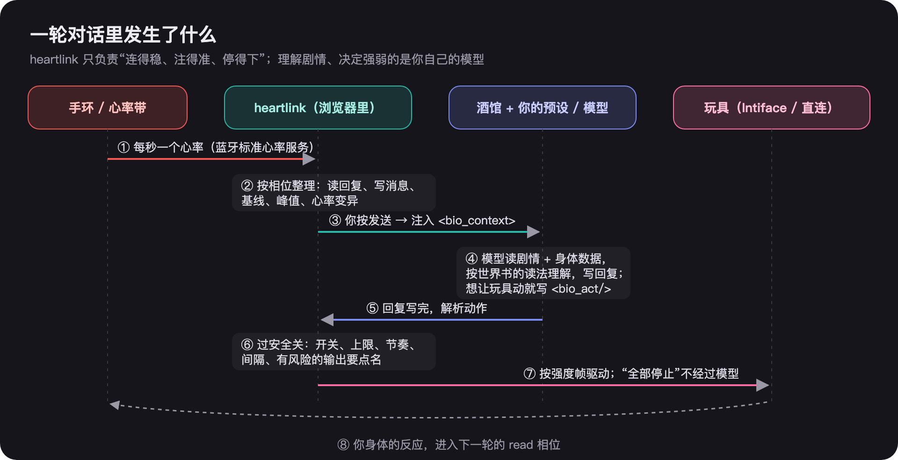
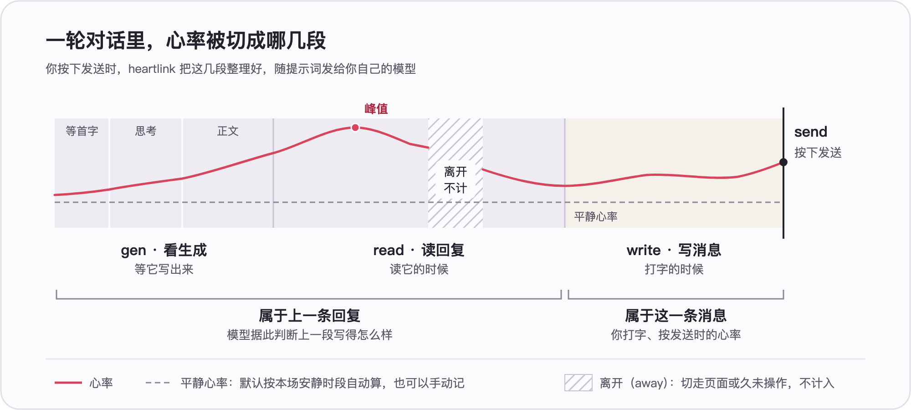
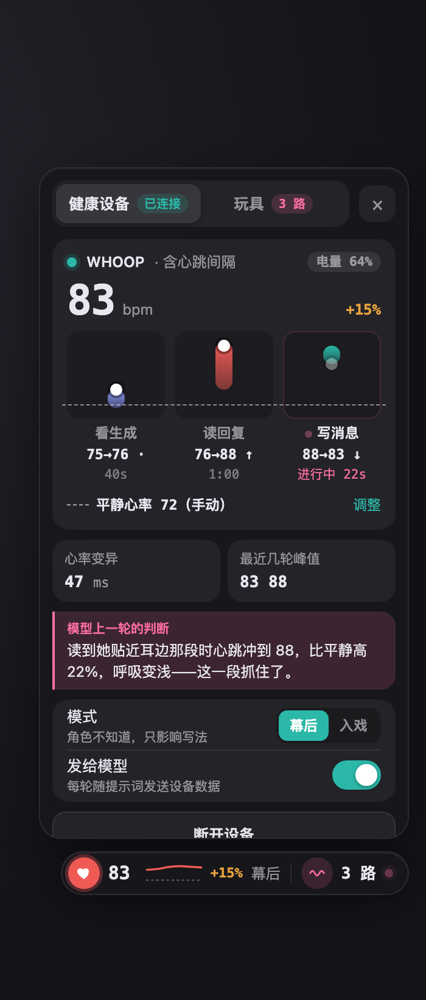
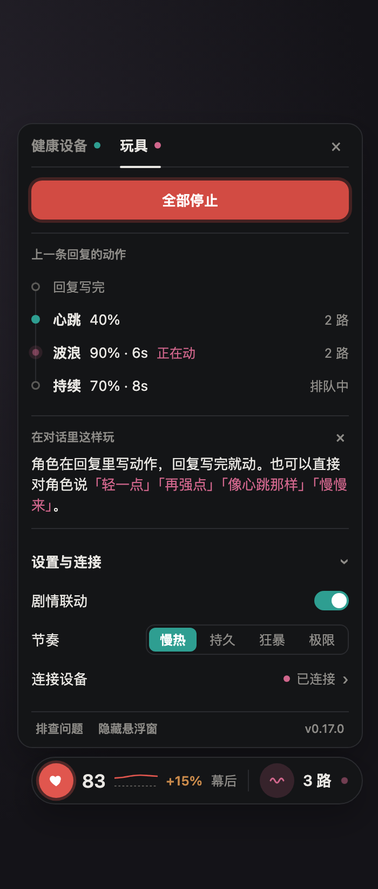

# heartlink

中文文档：[README.zh.md](README.zh.md) · [Supported devices](docs/devices.md) · [Usage details](docs/usage.md)

A SillyTavern extension that sends your heart rate into the prompt and lets the story drive your toys.

It is the reference implementation of the [Tavern Bio-Context (TBC)](https://github.com/kcgoofee-jpg/tavern-bio-context) protocol. It only does two things: **connect reliably** and **inject reliably**. How the story is interpreted, and how intense the action gets, is up to your own model and presets.

## How it works

heartlink does three things, **without interpreting the story for you**:

1. **Feeds device data into the prompt**: the browser receives one heart-rate sample per second over the standard Bluetooth Heart Rate Service. When you press send, it packages the last round's heart-rate data by conversation phase into a `<bio_context>` block and sends it to **the model you configured**. The block only contains numbers, not conclusions like "excited" or "nervous"; how to read them is up to the automatically installed reading world book and your presets.
2. **Turns model-written actions into toy actions**: the model writes `<bio_act/>` in its reply. After the reply finishes generating, heartlink parses it, passes it through safety gates (on/off, rhythm, spacing, risky outputs must be named), and hands it to Intiface or a browser-direct connection to drive the toy.
3. **Closes the loop**: your body's reaction feeds into the next round's data, so the model can tell how the last passage landed.



### Phases: how heart rate is sliced



The health-device page of the floating panel draws this round's chart in real time; the `+N%` on the capsule is relative to your resting heart rate. **Time you are away does not count**: from the moment you press send, switching tabs or apps, window losing focus, scrolling up to old messages, or the heart-rate strap not being attached properly are all excluded. The format is defined by the [Tavern Bio-Context protocol](https://github.com/kcgoofee-jpg/tavern-bio-context).

## Installation

SillyTavern → Extensions → **Install Extension**, paste this repository URL:

```
https://github.com/kcgoofee-jpg/heartlink-extension
```

After installation a floating panel appears in the bottom-right corner (drag to move; tap "Hide floating panel" to dismiss, then restore it from the wand menu). No SillyTavern helper script is required; if you have the old heartlink script inside the helper installed, please turn it off.

## Two device types, used separately

Tap the floating panel to open it; there are two tabs. Only the type you use is shown.

 

### Health devices (heart rate)

1. Turn on "heart-rate broadcast" on your band / strap. See [docs/devices.md](docs/devices.md) for supported devices and per-brand instructions.
2. Open SillyTavern in **Chrome / Edge** on a computer or Android phone (iPhone and Safari do not currently support Web Bluetooth).
3. Floating panel → Health device → **Connect device**, pick the device in the popup.
4. Choose a mode in "Settings & connection":

| Mode | What the character knows |
|---|---|
| **Behind the scenes** (default) | Nothing; heart rate only affects writing style |
| **In character** | Can sense your physical reactions (breathing, complexion) without mentioning numbers or devices |
| **Informed** | Knows you are wearing a device, can look at data, guide you, or explicitly say they made the toy move |

The third tab at the top of the floating panel is **Settings**. See [docs/usage.md](docs/usage.md) for the settings reference.

### Toys

1. Install and open [Intiface Central](https://intiface.com/central/), tap **Start Server**, and connect your toy inside it (supported models are in the buttplug device library). To skip the software, use **Browser-direct connection**; see [docs/devices.md](docs/devices.md).
2. Floating panel → Toys → turn on **Story联动**. The first time it will ask you to pick a rhythm: **Slow burn** (starts light), **Endurance** (medium intensity, longer pulses), **Frenzy** (high trigger chance, high power), or **Extreme** (almost always on full).
3. Tap **Connect via Intiface**. "Connected · N channels" means success.
4. At any time tap **Stop all**, or stop without opening the panel: type `/hl-stop` in the input, or press **Alt+Shift+S**. The page closing or Intiface disconnecting also stops immediately.

The toy page also lets you tap **Weaker / Stronger**, **Again**, or **Skip** to adjust, replay, or skip the current act in real time. See [docs/usage.md](docs/usage.md) for the full button behavior and device card layout.

## Safety

- Story联动 is off by default; it only moves after you turn it on.
- Stop all is always available; stopping does not go through the model. If the panel is covered, use `/hl-stop` or **Alt+Shift+S**.
- Safewords are optional and off by default.
- If the page closes, the connection drops, or you disconnect a toy, output stops immediately.
- Estim and any "built-in mode" that the device runs to completion require **per-device confirmation**; while a built-in mode is running the software may not be able to stop it.

## Privacy

Your heart rate is sent as a text block to **the model provider you configured**, and nowhere else. To stop sending it, disconnect the heart-rate device, or disable the extension.

## Compatibility notes

- The reading world book relies on SillyTavern's "World Info scan depth" to trigger (default 2). When set to 0, the model still receives the data but not the reading instructions.
- With Claude and Gemini, SillyTavern turns mid-conversation system messages into user messages before sending. The injected block content is unchanged; it is just no longer treated as a system instruction.

## Developer API

The page exposes `window.tbc` (TBC bus) and `window.heartlink`. Read-only APIs for character helpers / cards: `tbc.outputState()`, `tbc.replyActs()` (each record includes `feedback`), `tbc.feedbackLog()`, and events `bio:output-state`, `bio:reply-acts`, `bio:feedback`. Remotes, toy app bridges, etc. can report feedback via `tbc.feedback({ t, from, type, … })` (format is in protocol §5.12; malformed submissions are rejected).

## Feedback

Tested with your own device? Feedback is welcome following the TBC repository's [device testing guide](https://github.com/kcgoofee-jpg/tavern-bio-context/blob/main/docs/device-test-reports-zh.md).

## License

AGPL-3.0 (see `LICENSE`). Protocol text is in the TBC repository (CC BY 4.0).

## Acknowledgments

- BLE Heart Rate Profile (Bluetooth SIG), Web Bluetooth (W3C CG), RMSSD (ESC/NASPE 1996)
- SillyTavern and the SillyTavern helper script events / injection APIs; buttplug / Intiface Central (BSD-3-Clause)
- [HZXXXC/sillytavern-heart-rate-hrv](https://github.com/HZXXXC/sillytavern-heart-rate-hrv): the closest existing implementation; no code reused
- [Enclave0775/Intiface_Central-Sillytavern-plugin](https://github.com/Enclave0775/Intiface_Central-Sillytavern-plugin): source of the reading-speed simulation idea
